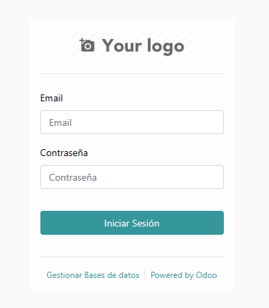

# Odoo4

### description

Odoo4 is a project to create a module open_academy to upload a excel file and create a text file
according to some rules specified in a reglas.json file using the Odoo 16 ERP.

## usage

### step 1

Install Odoo 16

[Odoo](https://www.odoo.com/es_ES)

### step 2

The module must be located in next path from your 

```bash
odoo/server/odoo/addons/
```

### step 3 

Open your browser and open the next url

```bash
localhost:8069
```

### step 4

Type email and password (According step 1)



### step 5

Delete Applications filter 


### step 6

Type open 


### step 7

Click thrre points right-up module and click actualizar or update option 


### step 8

Click nuevo or new button


### step 9

Type a name for the new register


### step 10

Click SUBA SU ARCHIVO or UPLOAD YOUR FILE button


### step 11

Select Excel file


### step 12

Click open_academy link to module home


### step 13

Click transformar link


### step 14

The program opens a new browser window with the result 


### step 15

Right click on the mouse to Save As option and then select a folder to keep it


